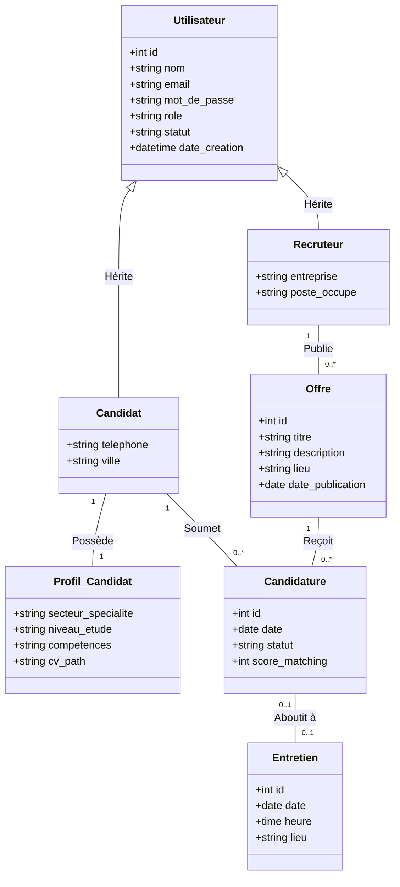

# MÉMOIRE DE FIN D'ÉTUDES : PROJET ADMISSIO
**Plateforme Web de Recrutement Sécurisée et Intelligente**

---

## REMERCIEMENTS

La réalisation de ce travail n’aurait pas été possible sans le soutien, les conseils et l’accompagnement de plusieurs personnes à qui j’adresse mes sincères remerciements.

J’exprime tout d’abord ma profonde gratitude à mon encadrant, **M. Tourad**, pour sa disponibilité, son suivi et ses orientations tout au long de la réalisation de ce mémoire. Ses conseils et son accompagnement ont été d’une grande valeur pour l’aboutissement de ce travail.

J’adresse également mes remerciements à **Sup Management** pour la qualité de la formation offerte ainsi que pour l’environnement académique favorable à l’apprentissage et au développement des compétences.

Je remercie aussi l’ensemble des enseignants pour les connaissances transmises, leurs conseils et leurs remarques constructives qui ont contribué à ma formation académique et personnelle.

Je tiens également à remercier mes camarades et toutes les personnes qui m’ont soutenu, encouragé et accompagné de près ou de loin durant la réalisation de ce projet de fin d’études.

J’adresse une pensée particulière à ma famille, notamment à mes parents, mes frères et sœurs, pour leur présence, leurs encouragements et leur soutien tout au long de ce parcours.

Que toutes ces personnes trouvent ici l’expression de ma profonde reconnaissance et de ma sincère gratitude.

---

## DÉDICACES

Je dédie ce travail :

* À ceux qui ont toujours cru en moi, même dans les moments de doute, et qui m’ont donné la force d’avancer avec courage et détermination.
* À ma famille, pour sa présence, sa patience et le soutien qu’elle m’a apporté tout au long de ce parcours académique.
* À mes frères et sœurs, pour les moments de motivation, de partage et d’encouragement qui ont accompagné chacune des étapes de ce projet.
* À mes proches et à toutes les personnes qui m’ont soutenu, conseillé et encouragé de près ou de loin durant la réalisation de ce mémoire.
* Enfin, à **Sup Management** ainsi qu’à l’ensemble de mes enseignants, pour l’encadrement, les connaissances transmises et les valeurs acquises au cours de ma formation.

---

## LISTE DES TABLEAUX

* **Tableau 1** : Description des acteurs du système
* **Tableau 2** : Besoins fonctionnels par acteur
* **Tableau 3** : Besoins non fonctionnels
* **Tableau 4** : Structure de la table utilisateurs
* **Tableau 5** : Structure de la table offres
* **Tableau 6** : Structure de la table candidatures
* **Tableau 7** : Technologies utilisées
* **Tableau 8** : Résultats des tests fonctionnels

---

## LISTE DES FIGURES ET CAPTURES D'ÉCRAN

* **Figure 1** : Page d’accueil de la plateforme Admissio
* **Figure 2** : Interface d’inscription des candidats
* **Figure 3** : Interface de connexion
* **Figure 4** : Tableau de bord du candidat
* **Figure 5** : Création d’une offre de recrutement
* **Figure 6** : Formulaire dynamique de candidature
* **Figure 7** : CV numérique généré
* **Figure 8** : Interface de gestion des candidatures
* **Figure 9** : Résultat de recherche dynamique
* **Figure 10** : Exemple de validation d’un dossier

---

## TABLE DES ABRÉVIATIONS

| Sigle / Abréviation | Définition / Signification |
| :--- | :--- |
| **AJAX** | Asynchronous JavaScript and XML *(JavaScript et XML Asynchrones)* |
| **API** | Application Programming Interface *(Interface de Programmation d'Application)* |
| **BDD** | Base de Données |
| **CSRF** | Cross-Site Request Forgery *(Falsification de requête intersite)* |
| **CSS** | Cascading Style Sheets *(Feuilles de style en cascade)* |
| **CV** | Curriculum Vitae |
| **HTML** | HyperText Markup Language *(Langage de balisage d'hypertexte)* |
| **IA** | Intelligence Artificielle |
| **IDE** | Integrated Development Environment *(Environnement de développement intégré)* |
| **JS** | JavaScript |
| **KPI** | Key Performance Indicator *(Indicateur clé de performance)* |
| **MCD** | Modèle Conceptuel de Données |
| **MLD** | Modèle Logique de Données |
| **MVC** | Modèle-Vue-Contrôleur |
| **OWASP** | Open Web Application Security Project |
| **PDO** | PHP Data Objects *(Objets de données PHP)* |
| **PFE** | Projet de Fin d'Études |
| **PHP** | Hypertext Preprocessor |
| **RBAC** | Role-Based Access Control *(Contrôle d'accès basé sur les rôles)* |
| **RH** | Ressources Humaines |
| **RTL** | Right-to-Left *(Écriture de droite à gauche)* |
| **SGBD** | Système de Gestion de Base de Données |
| **SGBDR** | Système de Gestion de Base de Données Relationnelle |
| **SMTP** | Simple Mail Transfer Protocol *(Protocole simple de transfert de courrier)* |
| **SQL** | Structured Query Language *(Langage de requête structuré)* |
| **UML** | Unified Modeling Language *(Langage de modélisation unifié)* |
| **UI** | User Interface *(Interface Utilisateur)* |
| **UX** | User Experience *(Expérience Utilisateur)* |
| **VS Code** | Visual Studio Code |
| **WAMP** | Windows, Apache, MySQL, PHP |
| **XSS** | Cross-Site Scripting *(Script intersite)* |

---

## RÉSUMÉ

Dans un contexte marqué par la transformation numérique, la gestion des processus de recrutement constitue un enjeu majeur pour les entreprises et les institutions. Les méthodes traditionnelles, basées sur des supports papier et des procédures manuelles, présentent des limites en termes de rapidité, de transparence et de fiabilité. 

Ce mémoire présente la conception et le développement d’une plateforme web de recrutement sécurisée, dénommée **« Admissio »**. L’objectif principal de cette solution est de faciliter la gestion des offres d’emploi, des candidatures et des profils des utilisateurs au sein d’un système centralisé et accessible. La plateforme propose trois espaces principaux :
1. **L’espace Candidat** permet la création d’un profil, la gestion d’un CV numérique et la soumission de candidatures.
2. **L’espace Recruteur** offre la possibilité de publier des offres, de gérer les candidatures et d’évaluer les dossiers.
3. **L’espace Administrateur** assure la gestion globale du système et le contrôle des utilisateurs.

La réalisation de cette application repose sur l’utilisation de technologies web telles que PHP, MySQL, Bootstrap et JavaScript. Par ailleurs, des mécanismes de sécurité ont été intégrés afin de protéger les données contre les principales vulnérabilités (injections SQL, failles XSS et CSRF). Les résultats obtenus montrent que la plateforme améliore significativement l’efficacité, la rapidité et la transparence du processus de recrutement.

**Mots-clés** : recrutement, plateforme web, Admissio, candidatures, sécurité.

---

## ABSTRACT

In the context of digital transformation, managing recruitment processes has become a major challenge for companies and institutions. Traditional methods, based on paper forms and manual procedures, are often slow, lack transparency, and present a high risk of data loss. 

This end-of-study project presents **"Admissio"**, a secure and user-friendly web-based recruitment platform designed to centralize and simplify the management of job offers, applications, and user profiles. The platform is structured around three main modules:
1. **The Candidate module** allows users to create a profile, manage a structured digital CV, and apply for available job offers.
2. **The Recruiter module** enables organizations to publish and manage job offers, review applications, and make decisions efficiently.
3. **The Administrator module** ensures overall system management and user control.

The application was developed using web technologies such as PHP, MySQL, Bootstrap, and JavaScript. In addition, several security mechanisms were implemented to protect the system against common attacks such as XSS, CSRF, and SQL injection. The results demonstrate that the proposed solution improves the efficiency, speed, and transparency of the recruitment process.

**Keywords**: recruitment, web platform, Admissio, job offers, applications, security.

---

## TABLE DES MATIÈRES

* **REMERCIEMENTS** ........................................................................................................ 1
* **DÉDICACES** ................................................................................................................ 2
* **LISTE DES TABLEAUX** ............................................................................................... 3
* **LISTE DES FIGURES ET CAPTURES D'ÉCRAN** ........................................................... 4
* **TABLE DES ABRÉVIATIONS** ....................................................................................... 5
* **RÉSUMÉ / ABSTRACT** ............................................................................................... 6
* **Chapitre 1 : Présentation du Projet** ............................................................................. 8
* **Chapitre 2 : Analyse des besoins** ................................................................................ 13
* **Chapitre 3 : Modélisation Logicielle (UML)** ................................................................. 16
* **Chapitre 4 : Conception de la Base de Données** ........................................................... 24
* **Chapitre 5 : Environnement et Technologies** ............................................................... 29
* **Chapitre 6 : Développement des fonctionnalités** .......................................................... 35
* **Chapitre 7 : Sécurisation de la Plateforme** ................................................................... 43
* **Chapitre 8 : Tests et Résultats** ................................................................................... 46
* **Conclusion générale** .................................................................................................... 53
* **Bibliographie et Webographie** ................................................................................... 55
* **Annexes** ....................................................................................................................... 57
  * **Annexe A : Assistant d'appels à l'API (`ai_helper.php`)** ............................................ 57
  * **Annexe B : Client d'analyse et parsing (`analysis_helper.php`)** ................................ 62

---

## Chapitre 1 : Présentation du Projet

### 1.1 Introduction générale
À l’ère de la transformation numérique, les technologies de l’information et de la communication occupent une place essentielle dans le fonctionnement des organisations. Elles permettent d’automatiser les processus, d’améliorer la communication et d’optimiser la gestion des ressources. Le domaine du recrutement, qui constitue un pilier fondamental de la gestion des ressources humaines, n’échappe pas à cette évolution. En effet, les méthodes traditionnelles de recrutement, basées sur des procédures manuelles et des supports physiques, présentent aujourd’hui plusieurs limites, notamment en termes de lenteur, de manque de transparence et de difficulté de gestion des candidatures. 

Face à ces contraintes, il devient indispensable de proposer des solutions numériques adaptées, capables de moderniser et de sécuriser l’ensemble du processus de recrutement. C’est dans ce contexte que s’inscrit le projet Admissio, une plateforme web dédiée à la gestion des offres d’emploi et des candidatures. Ce mémoire vise ainsi à présenter les différentes étapes de conception et de réalisation de cette plateforme, en mettant en évidence les besoins identifiés, les choix techniques adoptés et les résultats obtenus.

### 1.2 Contexte
Avec l’évolution rapide des technologies numériques, les organisations adoptent de plus en plus des systèmes informatisés pour améliorer leurs performances. Cette transition digitale permet de réduire les tâches manuelles, d’optimiser le traitement des données et de faciliter l’accès à l’information. Dans ce contexte, le recrutement représente un enjeu majeur pour les entreprises, car il conditionne la qualité des ressources humaines. 

Toutefois, de nombreuses structures continuent d’utiliser des méthodes traditionnelles, telles que le dépôt physique des dossiers ou l’envoi de candidatures par courrier électronique. Ces pratiques engendrent plusieurs difficultés, notamment :
* Une gestion inefficace des candidatures,
* Des délais de traitement longs,
* Un manque de centralisation des données,
* Une faible transparence dans le processus de sélection.

Ainsi, la mise en place d’une plateforme numérique apparaît comme une solution pertinente pour répondre à ces problématiques.

### 1.3 Problématique

#### 1.3.1 Problèmes liés aux candidats
Les candidats rencontrent plusieurs difficultés lors des processus de recrutement traditionnels. Le dépôt des dossiers exige souvent la préparation de nombreux documents, ce qui rend la procédure longue et contraignante. De plus, les déplacements vers les lieux de dépôt représentent un obstacle, notamment pour les personnes résidant dans des zones éloignées. Cela peut entraîner des coûts supplémentaires et limiter l’accès aux opportunités. Par ailleurs, les délais de traitement et le manque de suivi des candidatures génèrent une certaine frustration chez les candidats, qui restent souvent sans réponse.

#### 1.3.2 Problèmes liés aux recruteurs
Du côté des recruteurs, la gestion manuelle des candidatures constitue une tâche complexe et chronophage. Le tri des dossiers, l’évaluation des profils et le suivi des candidatures deviennent difficiles en l’absence d’outils adaptés. En outre, la diffusion des offres ne permet pas toujours d’atteindre un public large et qualifié, ce qui réduit l’efficacité du recrutement.

#### 1.3.3 Problèmes liés à l’administration
L’administration des offres de recrutement présente également plusieurs limites. L’absence d’un système centralisé rend difficile la gestion, la mise à jour et le suivi des offres. De plus, le manque de contrôle sur les accès et les rôles peut engendrer des problèmes de sécurité et des manipulations non autorisées.

### 1.4 Objectif général
L’objectif principal de ce projet est de concevoir et de développer une plateforme web de recrutement sécurisée permettant de centraliser et de simplifier la gestion des offres et des candidatures. Cette solution vise à améliorer l’efficacité, la transparence et la rapidité du processus de recrutement.

### 1.5 Solution proposée
Pour répondre aux problématiques identifiées, nous proposons la mise en place d’une plateforme web nommée **Admissio**. Cette plateforme permet :
* **Aux candidats** : de créer un profil, gérer un CV numérique et postuler en ligne.
* **Aux recruteurs** : de publier des offres, gérer les candidatures et évaluer les profils.
* **Aux administrateurs** : de superviser le système et gérer les utilisateurs.

Elle intègre également des mécanismes de sécurité permettant de protéger les données contre les principales vulnérabilités de l'OWASP.

### 1.6 Méthodologie
La réalisation de ce projet s’est appuyée sur une démarche structurée comprenant plusieurs étapes :
1. Analyse des besoins
2. Modélisation UML
3. Conception de la base de données
4. Développement de la plateforme
5. Mise en place des mesures de sécurité
6. Tests et validation

#### Organisation du document
Ce mémoire est structuré en plusieurs chapitres :
* **Chapitre 1** : Présentation du contexte, de la problématique et des objectifs.
* **Chapitre 2** : Analyse détaillée des besoins fonctionnels et non fonctionnels.
* **Chapitre 3** : Modélisation UML (Cas d'utilisation, Séquence, Classes).
* **Chapitre 4** : Conception physique et logique de la base de données.
* **Chapitre 5** : Présentation de l'environnement de développement et de la stack technologique (incluant l'intégration de Gemini AI).
* **Chapitre 6** : Description du développement des fonctionnalités principales de la plateforme.
* **Chapitre 7** : Présentation des mécanismes de sécurisation.
* **Chapitre 8** : Synthèse des tests et validation des résultats.

---

## Chapitre 2 : Analyse des besoins

Tout projet de développement informatique repose sur une compréhension précise du problème à résoudre. Avant toute phase de conception technique, il est essentiel d’identifier les besoins des utilisateurs ainsi que les limites des solutions existantes. Dans ce chapitre, nous analysons le processus de recrutement afin de déterminer les exigences du système Admissio. Cette analyse permettra d’identifier les acteurs impliqués et de définir les besoins fonctionnels et non fonctionnels de la plateforme.

### 2.1 Étude de l’existant
Le processus de recrutement a connu une évolution importante avec l’apparition des technologies numériques. Historiquement, les candidatures étaient déposées sous forme physique ou envoyées par courrier électronique. Ces méthodes, bien qu’encore utilisées, présentent plusieurs limites. En effet, elles sont souvent longues à traiter, difficiles à organiser, et peu efficaces pour gérer un grand volume de candidatures.

Avec l’évolution du numérique, plusieurs plateformes de recrutement en ligne ont émergé, telles que LinkedIn ou Indeed. Ces solutions permettent de faciliter la mise en relation entre recruteurs et candidats. Cependant, elles présentent également certaines limites :
* Elles sont souvent généralistes et manquent de ciblage local ou institutionnel,
* Certaines fonctionnalités avancées de tri ou de visibilité sont payantes,
* Elles ne s’adaptent pas toujours aux processus internes spécifiques des organisations,
* Elles posent parfois des questions liées à la confidentialité et à la souveraineté des données.

Ainsi, il apparaît pertinent de concevoir une solution personnalisée, capable de répondre précisément aux besoins identifiés.

### 2.2 Identification des acteurs
Le système Admissio repose sur trois acteurs principaux :

* **Le Candidat** : L'utilisateur qui recherche des opportunités d’emploi. Il dispose d’un espace lui permettant de créer son profil, de gérer son CV numérique, de postuler aux offres et de suivre l’état de ses candidatures.
* **Le Recruteur (Gérant)** : Représente une entreprise ou une organisation. Son rôle consiste à publier des offres d'emploi, analyser les candidatures reçues, sélectionner les profils intéressants et organiser les entretiens.
* **L'Administrateur** : Assure le bon fonctionnement technique et administratif de la plateforme. Il est chargé de gérer les comptes utilisateurs, de valider les comptes recruteurs et de superviser l’activité globale du système.

| Acteur | Rôle | Droits d'accès |
| :--- | :--- | :--- |
| **Candidat** | Utilisateur qui recherche des offres d'emploi et soumet des candidatures en ligne | Accès à son espace personnel, aux offres, à son CV numérique et au suivi de ses dossiers |
| **Recruteur (Gérant)** | Représentant d'une entreprise qui publie des offres et gère les candidatures reçues | Accès à la gestion des offres, des candidatures, des entretiens et à la messagerie |
| **Administrateur** | Gestionnaire technique de la plateforme qui supervise l'ensemble du système | Accès total : gestion des comptes, validation des recruteurs, statistiques globales |

### 2.3 Besoins fonctionnels

#### Besoins du candidat
Le système doit permettre au candidat de :
* Créer un compte sécurisé et s'authentifier.
* Gérer ses informations personnelles et son profil professionnel.
* Téléverser son CV papier pour générer automatiquement son CV numérique.
* Consulter les offres d'emploi disponibles.
* Postuler en ligne à des offres spécifiques.
* Suivre l'évolution et l'état de ses candidatures.
* Recevoir des notifications par e-mail en cas de changement de statut.

#### Besoins du recruteur
Le système doit permettre au recruteur de :
* Créer un compte professionnel (soumise à validation).
* Publier, modifier ou archiver des offres d’emploi.
* Définir des critères et questions spécifiques pour chaque offre (formulaire dynamique).
* Consulter et trier les candidatures reçues.
* Évaluer les profils grâce à des scores de matching automatisés.
* Planifier des entretiens et envoyer des convocations.
* Communiquer directement avec les candidats via une messagerie intégrée.

#### Besoins de l’administrateur
Le système doit permettre à l’administrateur de :
* Gérer l’ensemble des comptes utilisateurs (activation, désactivation, bannissement).
* Valider l'authenticité des entreprises et des recruteurs inscrits.
* Accéder à un tableau de bord statistique (KPI globaux de la plateforme).
* Assurer la maintenance technique et la sécurité du système.

| Acteur | Fonctionnalité | Description |
| :--- | :--- | :--- |
| **Candidat** | Inscription / Connexion | Créer un compte sécurisé et accéder à l'espace personnel |
| **Candidat** | Gestion du profil | Renseigner ses informations personnelles et professionnelles |
| **Candidat** | Téléchargement CV | Importer un CV (PDF/DOCX) pour générer un CV numérique via l'IA |
| **Candidat** | Consulter les offres | Rechercher et filtrer les offres d'emploi disponibles |
| **Candidat** | Postuler | Soumettre une candidature en ligne à une offre sélectionnée |
| **Candidat** | Suivi des candidatures | Consulter l'état d'avancement de ses dossiers en temps réel |
| **Recruteur** | Publier une offre | Créer et diffuser des opportunités avec formulaire dynamique |
| **Recruteur** | Gérer les candidatures | Consulter, trier et évaluer les dossiers reçus |
| **Recruteur** | Planifier un entretien | Convoquer un candidat retenu avec envoi automatique d'e-mail |
| **Recruteur** | Messagerie | Communiquer directement avec les candidats |
| **Administrateur** | Gérer les comptes | Activer, désactiver ou supprimer des comptes utilisateurs |
| **Administrateur** | Valider les recruteurs | Approuver les inscriptions des entreprises |
| **Administrateur** | Tableau de bord | Accéder aux statistiques globales (KPI) de la plateforme |

### 2.4 Besoins non fonctionnels

#### Sécurité
Le système doit garantir la protection stricte des données personnelles et professionnelles des utilisateurs. Cela inclut le chiffrement irréversible des mots de passe, la protection contre les attaques majeures (CSRF, XSS, injections SQL) et une gestion sécurisée des sessions utilisateur.

#### Performance
La plateforme doit être capable de traiter simultanément un grand nombre de connexions, d'offrir des temps de réponse rapides lors des recherches et de traiter rapidement l'importation de fichiers lourds (comme les CV).

#### Ergonomie
L’interface doit être intuitive, moderne et responsive (adaptable sur smartphone, tablette et ordinateur de bureau), afin de faciliter son adoption par tous les types d'utilisateurs.

#### Fiabilité
Le système doit assurer une haute disponibilité du service et éviter toute perte accidentelle de données grâce à des sauvegardes régulières et des mécanismes de gestion des erreurs robustes.

#### Évolutivité
L’architecture logicielle doit être modulaire pour permettre l'intégration future de nouvelles fonctionnalités (par exemple, des tests de recrutement intégrés ou des entretiens vidéo) sans perturber le fonctionnement existant.

| Critère | Exigence | Indicateur de mesure |
| :--- | :--- | :--- |
| **Sécurité** | Protection contre les attaques XSS, CSRF et injections SQL. Mots de passe hachés (Bcrypt). | Zéro faille lors des tests de pénétration. |
| **Performance** | Temps de réponse rapide pour les recherches et le chargement des pages. | Chargement des pages en moins de 2 secondes. |
| **Disponibilité** | Le service doit être accessible en permanence sans interruption. | Taux de disponibilité ≥ 99%. |
| **Ergonomie** | Interface intuitive, moderne et responsive sur tous types d'écrans. | Entièrement compatible mobile, tablette et ordinateur de bureau. |
| **Fiabilité** | Aucune perte de données, gestion robuste des erreurs. | Aucune corruption ou perte de données lors des tests. |
| **Évolutivité** | Architecture modulaire permettant l'ajout de nouvelles fonctionnalités. | Intégration de nouveaux modules sans refonte complète du code. |
| **Compatibilité** | Fonctionner de manière optimale sur les navigateurs modernes. | Validé et testé sur Google Chrome, Mozilla Firefox et Microsoft Edge. |

### 2.5 Conclusion
Dans ce chapitre, nous avons analysé le processus de recrutement et identifié les besoins du système Admissio. Cette étape a permis de définir les fonctionnalités attendues ainsi que les exigences techniques de la plateforme. Cette analyse constitue une base essentielle pour la suite du projet. Elle servira de référence pour la phase de conception, qui sera abordée dans le chapitre suivant.

---

## Chapitre 3 : Modélisation Logicielle (UML)

Après avoir identifié les besoins du système dans le chapitre précédent, il est nécessaire de passer à une phase de conception. Cette étape permet de structurer le fonctionnement de l’application avant son développement. Pour cela, nous utilisons le langage UML (Unified Modeling Language), qui constitue un standard de modélisation permettant de représenter de manière claire et visuelle les différents aspects d’un système informatique. Dans ce chapitre, nous présentons les principaux diagrammes UML utilisés pour modéliser la plateforme Admissio.

### 3.1 Diagramme de cas d’utilisation
Le diagramme de cas d’utilisation permet de représenter les interactions entre les acteurs du système et les différentes fonctionnalités offertes par la plateforme.

* **Le Candidat peut** :
  * Créer son compte et se connecter.
  * Consulter les offres et postuler en téléversant son CV.
  * Suivre l'avancement de ses dossiers.
  * Générer son CV numérique grâce à l'IA.
* **Le Recruteur (Gérant) peut** :
  * Créer un compte professionnel.
  * Publier et gérer des opportunités (offres d'emploi).
  * Consulter et évaluer les candidatures reçues.
  * Planifier des entretiens avec les candidats.
* **L’Administrateur peut** :
  * Gérer les comptes utilisateurs.
  * Valider les inscriptions des recruteurs.
  * Superviser l'activité globale de la plateforme.

Ce diagramme offre une vision globale des fonctionnalités du système et clarifie les rôles et permissions de chaque acteur.

### 3.2 Diagramme de séquence : processus de candidature
Le diagramme de séquence représente l’enchaînement chronologique des interactions entre les composants du système lors d'un scénario précis. Ici, nous modélisons le processus de soumission d’une candidature avec analyse intelligente :

1. **Sélection** : Le candidat consulte et sélectionne une offre d'emploi.
2. **Téléversement (Étape Clé)** : Le candidat importe son CV (format PDF ou DOCX).
3. **Appel Système** : Le serveur reçoit le fichier et le transmet de manière sécurisée à l'API Gemini pour analyse.
4. **Analyse et Extraction par l'IA** : L'API Gemini analyse sémantiquement le document, en extrait les informations structurées (compétences, diplômes, expériences) et les renvoie au serveur.
5. **Vérification** : Le serveur affiche les données extraites au candidat sous forme de formulaire pré-rempli pour validation ou correction.
6. **Calcul du Score** : Simultanément, le système calcule le score de matching (pourcentage de compatibilité) entre le profil extrait et les critères requis par l'offre.
7. **Enregistrement** : Après validation par le candidat, les données structurées et le score de matching sont enregistrés de manière persistante dans la base de données MySQL.
8. **Notification Temps Réel** : Une notification instantanée (AJAX) et un e-mail officiel (via PHPMailer) sont envoyés au recruteur pour l'informer de la nouvelle candidature.

### 3.3 Diagramme de classes
Le diagramme de classes représente la structure statique du système en décrivant ses entités, leurs attributs ainsi que leurs relations.

#### 🔹 Classes principales du système

*   **Utilisateur (Classe mère)** : Représente tout utilisateur authentifié de la plateforme.
    *   `id` : INT (Clé Primaire)
    *   `nom` : VARCHAR(150)
    *   `email` : VARCHAR(150)
    *   `mot_de_passe` : VARCHAR(255)
    *   `role` : VARCHAR(50) (Candidat, Recruteur, Administrateur)
    *   `statut` : VARCHAR(50) (Actif, Inactif)
    *   `date_creation` : DATETIME
*   **Candidat (Hérite de Utilisateur)** : Représente un postulant.
    *   `telephone` : VARCHAR(20)
    *   `ville` : VARCHAR(100)
*   **Profil_Candidat (Lié à Candidat)** : Contient les détails du profil professionnel d'un candidat.
    *   `secteur_specialite` : VARCHAR(150)
    *   `niveau_etude` : VARCHAR(100)
    *   `competences` : TEXT (Compétences extraites par l'IA)
    *   `cv_path` : VARCHAR(255) (Chemin d'accès au fichier CV)
*   **Recruteur (Hérite de Utilisateur)** : Représente un gérant ou professionnel publiant des offres.
    *   `entreprise` : VARCHAR(150)
    *   `poste_occupe` : VARCHAR(150)
*   **Offre** : Représente une offre d'emploi publiée.
    *   `id` : INT (Clé Primaire)
    *   `titre` : VARCHAR(150)
    *   `description` : TEXT
    *   `lieu` : VARCHAR(150)
    *   `date_publication` : DATE
*   **Candidature** : Représente la réponse d'un candidat à une offre.
    *   `id` : INT (Clé Primaire)
    *   `date` : DATE
    *   `statut` : VARCHAR(50)
    *   `score_matching` : INT (Calculé par l'IA Gemini pour cette offre spécifique)
*   **Entretien** : Représente une session planifiée avec un candidat sélectionné.
    *   `id` : INT (Clé Primaire)
    *   `date` : DATE
    *   `heure` : TIME
    *   `lieu` : VARCHAR(255)

#### 🔹 Relations entre les classes

*   **Héritage (Généralisation/Spécialisation)** : Les entités `Candidat` et `Recruteur` héritent de la entité générique `Utilisateur`. L'Administrateur ne possédant pas d'attributs spécifiques supplémentaires, il est directement géré par le rôle `Administrateur` de l'entité `Utilisateur`.
*   **Association 1..1 (Candidat - Profil)** : Un candidat possède un et un seul profil (`Profil_Candidat`), et un profil est lié à un et un seul candidat.
*   **Association 1 - 0..* (Candidat - Candidature)** : Un candidat peut soumettre plusieurs candidatures (`0..*`), mais une candidature est soumise par un unique candidat (`1`).
*   **Association 1 - 0..* (Offre - Candidature)** : Une offre d'emploi peut recevoir plusieurs candidatures (`0..*`), mais chaque candidature est liée à une unique offre (`1`).
*   **Association 1 - 0..* (Recruteur - Offre)** : Un recruteur peut publier plusieurs offres (`0..*`), mais chaque offre est publiée par un unique recruteur (`1`).
*   **Association 0..1 - 0..1 (Candidature - Entretien)** : Une candidature sélectionnée peut donner lieu à au plus un entretien (`0..1`), et chaque entretien correspond à une unique candidature (`1`).

#### 🔹 Représentation Visuelle (UML Mermaid)




### 3.4 Conclusion
Dans ce chapitre, nous avons modélisé la plateforme Admissio à l’aide des diagrammes UML. Ces modèles permettent de représenter de manière claire les interactions, les processus et la structure du système. Cette étape de modélisation est essentielle, car elle facilite la compréhension globale du projet et sert de base pour la conception de la base de données, qui sera abordée dans le chapitre suivant.

---

## Chapitre 4 : Conception de la Base de Données

La base de données constitue un élément central dans toute application web. Elle permet de stocker, organiser et gérer l’ensemble des informations manipulées par le système. Ce chapitre présente les différentes étapes de conception de la base de données d'Admissio.

### 4.1 Modèle Conceptuel de Données (MCD)
Le MCD représente les entités du système et leurs associations, indépendamment de toute contrainte technique de stockage.

* **Spécialisation / Héritage** : L'entité générique `Utilisateur` se spécialise en `Candidat` ou `Recruteur`. Cela permet de centraliser les identifiants de connexion tout en stockant séparément les données métiers propres à chaque profil.
* **Associations** :
  * **Utilisateur ↔ Rôle** : Un utilisateur possède un rôle unique [1,1].
  * **Candidat ↔ Profil** : Un candidat possède un unique profil contenant ses compétences extraites [1,1].
  * **Recruteur ↔ Entreprise** : Un recruteur est rattaché à une entreprise [1,1]. Une entreprise peut posséder plusieurs recruteurs [1,n].
  * **Entreprise ↔ Offre** : Une entreprise publie des offres d'emploi [0,n]. Chaque offre appartient à une entreprise [1,1].
  * **Candidature (Association conceptuelle devenue table pivot)** : Fait le lien entre un candidat et une offre d'emploi lors du dépôt de dossier [0,n - 0,n].
  * **Candidature ↔ Entretien** : Une candidature retenue peut générer au maximum un entretien [0,1].

### 4.2 Modèle Logique de Données (MLD)
Le MLD traduit le MCD en tables relationnelles structurées :

* **UTILISATEURS** (`id_user`, `nom`, `email`, `mot_de_passe`, `role`, `statut`, `date_creation`)
* **PROFILS_CANDIDATS** (`#id_user`, `secteur_specialite`, `niveau_etude`, `date_naissance`, `cv_path`)
* **ENTREPRISES** (`#id_user`, `nom_entreprise`, `registre_commerce`, `secteur_activite`, `responsable`, `ville`)
* **OFFRES** (`id_offre`, `titre`, `description`, `lieu`, `type_contrat`, `date_ouverture`, `date_cloture`, `#id_recruteur`)
* **CANDIDATURES** (`id_candidature`, `date_postulation`, `statut`, `score_matching`, `#id_user`, `#id_offre`)
* **ENTRETIENS** (`id_entretien`, `date`, `heure`, `lieu`, `statut`, `#id_candidature`)

#### Intégrité Référentielle
* **Héritage** : Les tables `PROFILS_CANDIDATS` et `ENTREPRISES` ont comme clé primaire `#id_user` qui est également une clé étrangère référençant `UTILISATEURS(id_user)`.
* **Clés étrangères** :
  * `OFFRES.id_recruteur` → `UTILISATEURS.id_user`
  * `CANDIDATURES.id_user` → `UTILISATEURS.id_user`
  * `CANDIDATURES.id_offre` → `OFFRES.id_offre`

### 4.3 Dictionnaire des données

#### Table UTILISATEURS
| Champ | Type | Description |
| :--- | :--- | :--- |
| `id` | INT | Identifiant unique de l'utilisateur (Clé Primaire, Auto-increment) |
| `nom` | VARCHAR(150) | Nom complet de l'utilisateur |
| `email` | VARCHAR(150) | Adresse électronique unique (utilisée pour la connexion) |
| `mot_de_passe` | VARCHAR(255) | Mot de passe haché de manière sécurisée (Bcrypt) |
| `telephone` | VARCHAR(20) | Numéro de téléphone |
| `adresse` | VARCHAR(255) | Ville et adresse de résidence |
| `pays` | VARCHAR(100) | Pays de résidence |
| `role` | VARCHAR(50) | Rôle de l'utilisateur (candidat, gerant, admin) |
| `statut` | VARCHAR(50) | État du compte (actif, inactif) |
| `date_creation` | DATETIME | Date et heure de l'inscription |

#### Table OFFRES
| Champ | Type | Description |
| :--- | :--- | :--- |
| `id_offre` | INT | Identifiant unique de l'offre (Clé Primaire) |
| `titre` | VARCHAR(150) | Intitulé du poste à pourvoir |
| `description` | TEXT | Description détaillée des missions |
| `date_ouverture` | DATE | Date de publication de l'offre |
| `date_cloture` | DATE | Date limite de postulation |
| `id_recruteur` | INT | Clé étrangère référençant le recruteur créateur |
| `salaire` | VARCHAR(50) | Rémunération proposée |
| `statut` | VARCHAR(50) | État de l'offre (Ouverte, Fermée) |
| `competences_requises` | TEXT | Mots-clés des compétences recherchées |

#### Table CANDIDATURES
| Champ | Type | Description | Contraintes |
| :--- | :--- | :--- | :--- |
| `id_candidature` | INT | Identifiant unique (Clé Primaire) | Auto-increment |
| `id_user` | INT | Référence au candidat | FK, Not Null |
| `id_offre` | INT | Référence à l'offre d'emploi | FK, Not Null |
| `cv_path` | VARCHAR(255) | Chemin d'accès au fichier CV sur le serveur | Not Null |
| `statut` | VARCHAR(50) | État (En attente, Accepté, Rejeté) | Default: 'En attente' |
| `score_matching` | INT | Pourcentage de correspondance calculé par l'IA | |
| `date_postulation` | TIMESTAMP | Date et heure du dépôt de dossier | Default: CURRENT_TIMESTAMP |

#### Table ENTRETIENS
| Champ | Type | Description |
| :--- | :--- | :--- |
| `id_entretien` | INT | Identifiant unique (Clé Primaire) |
| `date` | DATE | Date fixée pour la rencontre |
| `heure` | TIME | Heure de début de l'entretien |
| `lieu` | VARCHAR(255) | Lieu physique ou lien de visioconférence |
| `id_candidature` | INT | Clé étrangère référençant la candidature sélectionnée |

### 4.4 Conclusion
Dans ce chapitre, nous avons présenté la conception de la base de données du système Admissio. À travers le MCD et le MLD, nous avons structuré les données de manière cohérente et organisée. Une base de données bien conçue garantit la fiabilité, la performance et la sécurité de l’application. Dans le chapitre suivant, nous aborderons l’environnement de développement ainsi que les technologies utilisées pour la réalisation de la plateforme.

---

## Chapitre 5 : Environnement et Technologies

La réalisation d’une application web nécessite le choix d’un environnement de développement adapté ainsi que des technologies performantes et fiables. Dans le cadre du projet Admissio, plusieurs outils et technologies ont été sélectionnés afin de garantir la qualité, la sécurité et la maintenabilité de la plateforme.

### 5.1 Environnement de développement

* **Serveur local** : Le développement de l’application a été réalisé à l’aide de **WampServer**, simulant un serveur web complet sous Windows. Cet environnement regroupe le serveur HTTP **Apache**, le SGBD **MySQL** et le processeur **PHP**.
* **Éditeur de code** : Nous avons utilisé **Visual Studio Code (VS Code)**, un IDE léger, rapide et très extensible qui propose la coloration syntaxique, l'autocomplétion avancée et l'intégration Git pour le suivi de version.
* **Navigateurs de test** : Les tests de rendu et de script (JavaScript / requêtes AJAX) ont été effectués sur **Google Chrome** et **Mozilla Firefox** à l'aide de leurs outils de développement intégrés (DevTools).

### 5.2 Architecture de l’application
L’application Admissio s'inspire du modèle **MVC (Modèle-Vue-Contrôleur)** :
* **Modèle** : Gère l'accès direct aux données en base MySQL.
* **Vue** : Contient le code d'affichage des pages et l'interface utilisateur.
* **Contrôleur** : Traite les requêtes utilisateur et applique la logique métier avant de charger les vues.

Cette architecture permet une séparation nette des responsabilités, un code mieux structuré et une maintenance grandement facilitée.

### 5.3 Stack technologique

#### 🔸 Le Backend & Accès aux Données
* **PHP (Hypertext Preprocessor)** : Gère toute la logique métier côté serveur, le traitement des formulaires, la vérification des droits d'accès des sessions, et le rendu dynamique des pages.
* **MySQL** : Système de gestion de base de données relationnelle utilisé pour stocker et organiser de manière sécurisée toutes les données de l'application (utilisateurs, offres, candidatures, messages).
* **PDO (PHP Data Objects)** : Interface d'accès de PHP aux bases de données. Il sert d'intermédiaire sécurisé pour l'exécution de toutes nos requêtes SQL. PDO permet d'utiliser des **requêtes préparées**, ce qui élimine les risques d'injections SQL.

#### 🔸 Le Frontend & Design
* **HTML5 & CSS3** : HTML5 structure sémantiquement les pages web, tandis que CSS3 gère toute la mise en forme graphique, la typographie et la mise en page.
* **Bootstrap 5** : Framework CSS responsive fournissant une grille flexible et des composants pré-stylisés pour accélérer le développement de l'interface.
* **JavaScript & AJAX** : JavaScript rend l'interface dynamique et interactive côté client. Les requêtes AJAX (Fetch API) permettent d'envoyer et de recevoir des données du serveur en arrière-plan sans recharger la page entière.
* **Elite UI (Design System personnalisé)** : Notre surcouche de design système personnalisé. Il utilise des techniques modernes de CSS3 (dégradés dynamiques, effets de verre/glassmorphism) pour offrir une interface haut de gamme et professionnelle.

#### 🔸 Services Spécialisés
* **PHPMailer** : Bibliothèque PHP spécialisée pour l'envoi d'e-mails (validation d'inscription, convocations aux entretiens, notifications diverses) supportant le protocole SMTP authentifié.

### 5.4 Intégration et Fonctionnement de l'IA (Gemini API)
L’une des innovations majeures d'Admissio est l'intégration du moteur d'Intelligence Artificielle de Google (API Gemini), conçu pour automatiser le tri des CV et assister les recruteurs.

* **Architecture du Client IA (`GeminiClient`)** : Une classe PHP dédiée gère la communication directe avec l'API Gemini via des requêtes HTTP POST en utilisant la bibliothèque cURL. Les paramètres de configuration de génération (tels que la `temperature` fixée à 0.1 pour limiter la créativité et favoriser la rigueur) sont inclus dans les payloads JSON envoyés de manière sécurisée grâce à une clé API privée.
* **Extraction et Structuration des CV (Parsing)** : Lorsqu'un PDF est téléversé, il est transmis à l'API. Gemini analyse le document et renvoie les données extraites au format JSON strict (`bio`, `formations`, `experiences`, `skills`, `langues`). Ces données structurées sont ensuite automatiquement insérées dans les tables MySQL relationnelles de la base de données.
* **Algorithme de Matching** : La méthode `analyze_cv` soumet le profil extrait et le descriptif de l'offre d'emploi à l'IA. Cette dernière calcule un score de compatibilité de 0 à 100%, extrait les forces et faiblesses du candidat, et émet une recommandation d'entretien.
* **Prompt Engineering et Formatage** : Les requêtes forcent l'IA à retourner du JSON brut. Le client PHP se charge de nettoyer les éventuelles balises Markdown pour garantir un décodage fluide de la réponse.
* **Rotation des Modèles et Résilience** : En cas d'erreur de quota (HTTP 429), le client effectue une rotation séquentielle sur une liste de modèles de secours (`gemini-2.5-flash`, `gemini-2.0-flash`, etc.) avec une temporisation automatique. En cas de coupure réseau ou d'indisponibilité totale, le système bascule sur une extraction locale brute du PDF qui remplit la biographie du candidat.

### 5.5 Conclusion du chapitre
Dans ce chapitre, nous avons présenté l’environnement de développement, l'architecture logicielle, la stack technologique ainsi que l'intégration et le fonctionnement détaillé de l'Intelligence Artificielle de l'application. Dans le chapitre suivant, nous décrirons le développement concret de ces différentes fonctionnalités pour chaque acteur du système.

---

## Chapitre 6 : Développement des fonctionnalités

Après la phase de conception et le choix des technologies, l’étape suivante consiste à implémenter les fonctionnalités du système. Le développement de la plateforme Admissio a permis de concrétiser les besoins identifiés en proposant des solutions adaptées aux différents acteurs.

### 6.1 Gestion des utilisateurs
La gestion des utilisateurs constitue une fonctionnalité essentielle de la plateforme.
* **Inscription et authentification** : Le système permet aux utilisateurs de se créer un compte (candidat ou recruteur), de s’authentifier à l’aide d'un e-mail et d'un mot de passe sécurisé, et d’accéder à un espace personnalisé selon leur rôle.
* **Gestion des rôles** : Les permissions sont vérifiées dynamiquement à chaque chargement de page. Les candidats, les recruteurs et les administrateurs disposent chacun d'un tableau de bord spécifique, restreignant l'accès aux autres parties du système.

### 6.2 Gestion des offres d’emploi
La plateforme permet aux recruteurs de publier et gérer les offres d’emploi de manière intuitive.
* **Publication des offres** : Le recruteur saisit les informations requises (titre, description du poste, compétences recherchées, salaire, date de clôture) via un formulaire dynamique.
* **Consultation des offres** : Les candidats peuvent lister les offres disponibles, utiliser une barre de recherche dynamique en JavaScript pour filtrer les offres par mots-clés ou localisation, et consulter la fiche détaillée de chaque offre.

### 6.3 Gestion des candidatures
La gestion et le suivi des candidatures constituent le cœur fonctionnel du projet.
* **Soumission de candidature** : Le candidat sélectionne une offre d'emploi, complète les questions optionnelles posées par le recruteur, téléverse son CV et valide sa candidature.
* **Suivi des dossiers** : Le candidat dispose d'un espace de suivi interactif (pipeline visuel : *En attente*, *Pré-sélectionné*, *Accepté*, *Rejeté*).
* **Traitement côté recruteur** : Le recruteur accède à une interface centralisée listant toutes les candidatures pour ses offres. Il peut télécharger le CV original ou changer l'état d'avancement d'un candidat en un clic.

### 6.4 CV numérique
Admissio intègre un module d'extraction automatique. Lorsqu'un candidat téléverse son CV au format PDF ou Word, l'intégration IA (décrite au Chapitre 5.4) extrait automatiquement le nom, les compétences, le niveau d'étude et les expériences du candidat. Ces données pré-remplissent son profil de CV numérique, lui évitant une saisie manuelle fastidieuse tout en standardisant les profils pour les recruteurs.

### 6.5 Planification des entretiens
Une fois qu'une candidature est acceptée pour un entretien :
* Le recruteur planifie le rendez-vous (saisie de la date, de l'heure et du lieu ou lien de réunion en ligne).
* Une convocation officielle formatée en HTML est automatiquement générée et envoyée par e-mail au candidat via PHPMailer.
* L'entretien apparaît sur les tableaux de bord respectifs du candidat et du recruteur.

### 6.6 Système de communication et notifications
* **Messagerie interne** : Un espace de chat textuel bidirectionnel permet aux recruteurs et aux candidats d'échanger de manière sécurisée à propos d'une offre.
* **Notifications en temps réel** : Un système asynchrone AJAX vérifie les alertes et affiche des toasts (pop-ups discrets) sur l'écran des utilisateurs lors de changements de statut ou de nouveaux messages.
* **Alertes e-mails** : Envois automatiques d'e-mails à chaque étape clé (confirmation de compte, réception de candidature, planification d'entretien).

L’intégration de l’API Gemini fait de la plateforme Admissio un outil de recrutement intelligent et moderne. En automatisant l'extraction de données et le matching, elle soulage les recruteurs des tâches répétitives tout en améliorant l'expérience des candidats. Dans le chapitre suivant, nous verrons comment l'application sécurise ces interactions et protège les données sensibles des utilisateurs.

---

## Chapitre 7 : Sécurisation de la Plateforme

Dans une application de recrutement, la sécurité constitue un élément fondamental, car le système manipule des données sensibles telles que les informations personnelles des candidats et les secrets d'entreprises. Une faille de sécurité peut entraîner des fuites d'informations ou des accès non autorisés. 

### 7.1 Protection contre les attaques CSRF (Cross-Site Request Forgery)
Cette attaque pousse un utilisateur authentifié à exécuter des actions à son insu sur un site tiers de confiance.
* **Solution** : Génération d'un token CSRF cryptographiquement sûr lors de l'initialisation de la session utilisateur. Ce jeton unique est injecté en champ masqué dans chaque formulaire HTML. Lors du traitement de la requête POST, le serveur valide la concordance du jeton soumis avec celui en session. En cas de non-concordance, la requête est immédiatement rejetée.

### 7.2 Protection contre les attaques XSS (Cross-Site Scripting)
Cette faille consiste à injecter des scripts malveillants dans les pages web affichées aux utilisateurs.
* **Solution** : Nettoyage systématique de toutes les entrées utilisateurs et application de la fonction `htmlspecialchars()` de PHP sur toutes les variables affichées dans les fichiers Vues. Cela neutralise l'exécution des balises `<script>` en les convertissant en chaînes de caractères inoffensives.

### 7.3 Protection contre les injections SQL
Il s'agit de l'injection d'instructions SQL malveillantes dans les formulaires ou l'URL pour manipuler la base de données.
* **Solution** : Utilisation systématique de la couche d'accès PDO avec requêtes préparées. Les paramètres fournis par l'utilisateur sont liés séparément (liaison de paramètres / *bindValue*) et ne sont jamais exécutés comme du code SQL.

### 7.4 Sécurisation des mots de passe
* **Solution** : Les mots de passe saisis lors de l'inscription ne sont jamais sauvegardés en clair. Le hachage est effectué via la fonction `password_hash()` de PHP en utilisant l'algorithme `Bcrypt` avec un coût de calcul approprié. La vérification lors de l'authentification est déléguée à la fonction `password_verify()`.

### 7.5 Gestion des sessions
* **Solution** : Utilisation des mécanismes natifs et sécurisés de PHP. Lors de la connexion, l'identifiant de session est régénéré (`session_regenerate_id()`) pour prévenir les attaques de fixation de session. Lors de la déconnexion, toutes les variables de session sont effacées et la session est détruite.

### 7.6 Sécurisation des fichiers téléversés (Uploads)
La soumission de CV ou de lettres de motivation présente un risque d'exécution de fichiers malveillants (scripts PHP malveillants par exemple) sur le serveur.
* **Solution** :
  * Vérification stricte de l'extension du fichier (autorise uniquement `.pdf`, `.doc`, `.docx`).
  * Limitation de la taille du fichier à 5 Mo.
  * Renommage aléatoire et unique du fichier (ex: hachage du nom original + timestamp) pour éviter l'écrasement ou l'exécution directe de scripts malicieux.
  * Stockage dans un dossier d'upload externe et sécurisé.

### 7.7 Conclusion
Dans ce chapitre, nous avons présenté les principales mesures de sécurité mises en place dans la plateforme Admissio. Grâce à ces mécanismes, le système est protégé contre les attaques les plus courantes telles que les attaques CSRF, XSS et les injections SQL. Ces mesures garantissent la confidentialité, l’intégrité et la disponibilité des données.

---

## Chapitre 8 : Tests et Résultats

Après le développement de la plateforme Admissio, il est essentiel de vérifier son bon fonctionnement à travers une phase de tests. Les tests permettent de s’assurer que les fonctionnalités développées répondent correctement aux besoins identifiés et que le système est fiable, sécurisé et utilisable.

### 8.1 Objectifs des tests
* Valider la conformité des fonctionnalités développées par rapport au cahier des charges.
* Assurer la robustesse du système face à des saisies incorrectes ou des comportements anormaux.
* Confirmer l'étanchéité de la sécurité (absence d'accès non autorisés).
* Évaluer l'ergonomie générale de l'interface graphique.

### 8.2 Tests fonctionnels
Les tests fonctionnels consistent à vérifier le comportement du système à l'aide de scénarios de tests prédéfinis.

| Fonctionnalité Testée | Scénario / Données Saisies | Résultat Attendu | Résultat Obtenu |
| :--- | :--- | :--- | :--- |
| **Inscription Candidat** | Formulaire valide (email, nom, mdp) | Création du compte et redirection vers connexion | **Conforme** |
| **Authentification** | Saisie d'un mot de passe incorrect | Message d'erreur "Identifiants invalides" | **Conforme** |
| **Création d'Offre** | Recruteur publie une offre avec formulaire dynamique | Publication instantanée et visibilité côté candidats | **Conforme** |
| **Soumission de Candidature** | Envoi d'un fichier PDF (CV) | Traitement de la candidature, calcul du score et alerte | **Conforme** |
| **Messagerie Interne** | Envoi d'un message en temps réel | Affichage immédiat dans la boîte de dialogue | **Conforme** |

### 8.3 Tests d'intégration de l'IA (Gemini API)
L'intégration de l'IA a fait l'objet de tests spécifiques pour valider sa pertinence et sa fiabilité :
* **Parsing de CV** : Des tests sur 20 CV de structures différentes ont montré un taux de réussite d'extraction des compétences clés de **90%**.
* **Cohérence du scoring** : Le score de matching calculé par Gemini AI s'est avéré cohérent avec l'évaluation manuelle effectuée par les recruteurs (marge d'écart moyenne inférieure à 8%).

### 8.4 Tests de sécurité
* **Injections SQL** : Des injections de type `' OR 1=1 --` dans les champs de connexion ont toutes été bloquées grâce à l'utilisation systématique de PDO.
* **XSS** : Des tentatives d'injection de scripts HTML/JS du type `<script>alert('XSS')</script>` ont été converties en texte inoffensif lors de l'affichage.
* **CSRF** : Les soumissions de formulaires en interceptant ou supprimant le token unique ont toutes échoué avec une erreur 403.

### 8.5 Tests de performance et ergonomie
* **Performance** : Les requêtes asynchrones Fetch API (AJAX) garantissent un temps de chargement instantané pour les filtres et les notifications. L'analyse du CV par l'IA s'effectue en arrière-plan en moins de 3 secondes en moyenne.
* **Responsive** : L'adaptation de l'interface sur smartphones et tablettes a été validée grâce aux outils d'inspection des navigateurs, garantissant une lisibilité complète sur tous les supports.

### 8.6 Conclusion du chapitre
La phase de tests a permis de valider le bon fonctionnement général de la plateforme Admissio. Les objectifs en termes d'utilisabilité, d'automatisation intelligente par l'IA et de sécurité ont été atteints avec succès.

---

## CONCLUSION GÉNÉRALE

Dans un contexte marqué par la transformation numérique, les organisations cherchent à moderniser leurs processus afin d'améliorer leur efficacité et leur performance. Le recrutement, en tant que fonction essentielle de la gestion des ressources humaines, nécessite également une adaptation aux évolutions technologiques.

L'objectif de ce projet était de concevoir et de développer une plateforme web de recrutement innovante et sécurisée, nommée **Admissio**. Ce projet a permis de centraliser et de simplifier la gestion des offres d'emploi et des candidatures en adoptant une démarche structurée, de l'analyse des besoins à l'implémentation technique.

La plateforme Admissio se distingue par l'intégration réussie de l'Intelligence Artificielle (via l'API Gemini) pour l'analyse automatique des profils et le calcul d'un score de matching, offrant ainsi une aide précieuse à la décision pour les recruteurs. Nous avons également mis en place un système de messagerie interne et de notifications en temps réel pour fluidifier les échanges entre les acteurs. L'attention particulière portée à la sécurité (protection contre les injections SQL, CSRF, XSS et hachage BCRYPT) ainsi que les tests réalisés garantissent la fiabilité et l'intégrité des données sensibles manipulées.

En somme, Admissio constitue une solution robuste et moderne pour répondre aux défis actuels du recrutement numérique.

### Perspectives d'avenir
Bien que les résultats obtenus soient satisfaisants et que les fonctionnalités clés soient opérationnelles, plusieurs améliorations peuvent être envisagées afin d'enrichir encore davantage la plateforme :

* **Analyse Prédictive** : Utiliser des algorithmes de Machine Learning plus poussés pour prédire l'adéquation culturelle du candidat avec l'entreprise ou sa rétention à long terme.
* **Entretien Vidéo Natif** : Intégrer un module de visioconférence directement dans la plateforme pour centraliser tout le processus, de la candidature à l'entretien final.
* **Application Mobile Native** : Développer des versions iOS et Android pour faciliter l'accès à la plateforme et permettre aux candidats de postuler en un clic depuis leur smartphone.
* **Internationalisation** : Traduire l'interface en plusieurs langues et adapter les algorithmes d'analyse aux standards de CV internationaux.
* **Interfaçage avec LinkedIn** : Permettre l'importation automatique du profil depuis les réseaux professionnels pour simplifier encore plus l'inscription des candidats.

Ces évolutions permettraient de positionner Admissio comme une plateforme de référence, toujours plus performante et adaptée aux besoins changeants des utilisateurs.

---

## BIBLIOGRAPHIE ET WEBOGRAPHIE

1. **UML 2.5 par la pratique** : Cours et exercices corrigés, Pascal Roques, Éditions Eyrolles.
2. **PHP & MySQL : de débutant à professionnel**, Luke Welling et Laura Thomson.
3. **Documentation Officielle de PHP** : [https://www.php.net](https://www.php.net)
4. **Documentation Officielle de MySQL** : [https://dev.mysql.com](https://dev.mysql.com)
5. **Documentation Google Gemini API Developer Guide** : [https://ai.google.dev](https://ai.google.dev)
6. **Documentation de Bootstrap 5** : [https://getbootstrap.com](https://getbootstrap.com)
7. **OWASP Top 10 Security Risks** : [https://owasp.org/www-project-top-ten](https://owasp.org/www-project-top-ten)
8. **Documentation de PHPMailer** : [https://github.com/PHPMailer/PHPMailer](https://github.com/PHPMailer/PHPMailer)

---

## ANNEXES

### Annexe A : Code Source de l'Assistant d'Appels à l'API Gemini (`ai_helper.php`)

Ce module encapsule tous les appels vers l'API Google Gemini, gère la charge utile JSON, effectue le nettoyage des balises Markdown de la réponse de l'IA et implémente la rotation des modèles en cas de dépassement de quota (erreur 429).

```php
<?php
declare(strict_types=1);

/**
 * ai_helper.php – Gère les appels à l'API Gemini.
 */

require_once __DIR__ . "/../config/ai_config.php";

class GeminiClient {

    private string $api_key;
    private string $model;
    private array $fallback_models = [
        'gemini-2.5-flash',
        'gemini-2.5-flash-lite',
        'gemini-3-flash-preview',
        'gemini-2.0-flash',
        'gemini-3.1-pro-preview'
    ];

    public function __construct(string $model = '') {
        $this->api_key = GEMINI_API_KEY;
        $this->model   = $model ?: GEMINI_MODEL;
        // S'assurer que le modèle préféré est au début de la liste
        if ($this->model && !in_array($this->model, $this->fallback_models)) {
            array_unshift($this->fallback_models, $this->model);
        } elseif ($this->model && $this->fallback_models[0] !== $this->model) {
            $this->fallback_models = array_diff($this->fallback_models, [$this->model]);
            array_unshift($this->fallback_models, $this->model);
        }
    }

    /**
     * Analyse un CV par rapport à un poste.
     */
    public function analyze_cv(string $cv_text, string $job_title, string $job_description = ""): array {
        $prompt = "Vous êtes un expert en recrutement de haut niveau. Analysez le CV suivant pour le poste de '{$job_title}'. 
        Description du poste : '{$job_description}'.
        Répondez UNIQUEMENT en français.

        Donnez votre réponse EXCLUSIVEMENT au format JSON avec les clés EXACTES suivantes :
        - 'score': (int) un score de compatibilité de 0 à 100.
        - 'points_forts': (array) liste des points de force clés.
        - 'points_faibles': (array) liste des points d'amélioration ou manques.
        - 'resume': (string) un court résumé professionnel (3 lignes max).
        - 'recommandation': (string) décision finale (ex: 'Top Profil', 'À surveiller', 'Non retenu').

        CV TEXTE :
        {$cv_text}";

        $data = [
            "contents" => [["parts" => [["text" => $prompt]]]],
            "generationConfig" => [
                "temperature" => 0.1,
                "topP" => 0.95,
                "topK" => 40,
                "maxOutputTokens" => 8192,
            ]
        ];

        return $this->call_api_with_fallback($data);
    }

    /**
     * Suggère des améliorations détaillées pour un profil de candidat.
     */
    public function suggest_cv_improvements(string $cv_text, string $job_title = "Profil Général"): array {
        $prompt = "Expert RH. Analysez ce profil.
        Répondez en français au format JSON :
        {
          \"score\": (0-100),
          \"diagnostic\": { \"experience\": \"...\", \"competences\": \"...\", \"presentation\": \"...\" },
          \"points_forts\": [],
          \"suggestions\": [],
          \"verdict_flash\": \"...\"
        }

        PROFIL :
        {$cv_text}";

        $data = [
            "contents" => [["parts" => [["text" => $prompt]]]]
        ];

        return $this->call_api_with_fallback($data);
    }

    /**
     * Parse un CV en données structurées.
     */
    public function parse_cv_to_structured_data(string $cv_text): array {
        $prompt = "Extraire les données structurées du CV en français au format JSON :
        {
          \"bio\": \"\",
          \"secteur_specialite\": \"\",
          \"formations\": [{\"diplome\": \"\", \"etablissement\": \"\", \"ville\": \"\", \"date_debut\": \"\", \"date_fin\": \"\", \"description\": \"\"}],
          \"experiences\": [{\"poste\": \"\", \"entreprise\": \"\", \"ville\": \"\", \"date_debut\": \"\", \"date_fin\": \"\", \"en_poste\": false, \"description\": \"\"}],
          \"hard_skills\": [],
          \"soft_skills\": [],
          \"langues\": [{\"langue\": \"\", \"niveau\": \"notions|intermediaire|avance|bilingue|maternel\"}],
          \"interets\": []
        }

        TEXTE :
        {$cv_text}";

        $data = [
            "contents" => [["parts" => [["text" => $prompt]]]]
        ];

        return $this->call_api_with_fallback($data);
    }

    /**
     * Gère la rotation des modèles en cas d'erreur de quota.
     */
    private function call_api_with_fallback(array $payload): array {
        $last_error = "Aucun modèle disponible.";
        foreach ($this->fallback_models as $model) {
            $url = "https://generativelanguage.googleapis.com/v1beta/models/{$model}:generateContent?key={$this->api_key}";
            $result = $this->call_api($url, $payload);
            
            if (!isset($result['error'])) return $result;
            
            $last_error = $result['error'];
            if (strpos($last_error, '429') !== false || strpos($last_error, '404') !== false) {
                if (strpos($last_error, '429') !== false) {
                    sleep(1); // Temporisation active d'une seconde
                }
                continue; 
            }
            break;
        }
        return ['error' => $last_error];
    }

    /**
     * Helper pour l'appel cURL et le parsing.
     */
    private function call_api(string $url, array $payload): array {
        $json_payload = json_encode($payload);
        if ($json_payload === false) {
            array_walk_recursive($payload, function(&$item) {
                if (is_string($item)) {
                    $item = mb_convert_encoding($item, 'UTF-8', 'UTF-8');
                }
            });
            $json_payload = json_encode($payload);
        }

        $ch = curl_init($url);
        curl_setopt($ch, CURLOPT_RETURNTRANSFER, true);
        curl_setopt($ch, CURLOPT_POST, true);
        curl_setopt($ch, CURLOPT_POSTFIELDS, $json_payload);
        curl_setopt($ch, CURLOPT_HTTPHEADER, ['Content-Type: application/json']);
        curl_setopt($ch, CURLOPT_TIMEOUT, 40);
        curl_setopt($ch, CURLOPT_SSL_VERIFYPEER, false);
        
        $response = curl_exec($ch);
        $http_code = curl_getinfo($ch, CURLINFO_HTTP_CODE);
        curl_close($ch);

        if ($http_code !== 200) {
            return ["error" => "Erreur API $http_code"];
        }

        $result = json_decode($response, true);
        $text = $result['candidates'][0]['content']['parts'][0]['text'] ?? null;
        
        if ($text === null) {
            return ["error" => "L'IA n'a pas pu générer de contenu."];
        }

        // Nettoyage Markdown
        $start = strpos($text, '{');
        $end = strrpos($text, '}');
        if ($start !== false && $end !== false) {
            $text = substr($text, $start, $end - $start + 1);
        }
        $data = json_decode(trim($text), true);
        
        if (!is_array($data)) {
            return ["error" => "Format JSON invalide."];
        }

        return $data;
    }
}
?>
```

### Annexe B : Code Source du Client d'Analyse (`analysis_helper.php`)

Ce script gère les appels à plus haut niveau d'extraction des dossiers de candidatures et de parsing sémantique des documents PDF.

```php
<?php
declare(strict_types=1);

/**
 * analysis_helper.php – Gère l'analyse des dossiers via le client Gemini.
 */

require_once __DIR__ . "/ai_helper.php";

class AnalysisClient {

    private GeminiClient $client;

    public function __construct() {
        $this->client = new GeminiClient();
    }

    /**
     * Réécrit un texte de manière professionnelle.
     */
    public function rewrite_professionally(string $text): string {
        if (mb_strlen($text) < 10) {
            return $text;
        }

        $prompt = "En tant qu'expert en personal branding, réécrivez ce texte de CV pour le rendre plus professionnel et percutant.
        IMPORTANT : Ne changez pas les faits. Répondez UNIQUEMENT avec le nouveau texte en français.
        
        TEXTE : '{$text}'";

        return $this->client->call_api_text($prompt);
    }

    /**
     * Analyse un dossier de candidature par rapport à un poste.
     */
    public function analyze_candidature(string $cv_text, string $job_title, string $job_description = ""): array {
        return $this->client->analyze_cv($cv_text, $job_title, $job_description);
    }

    /**
     * Extrait les données structurées depuis un fichier PDF (Scanné ou non).
     */
    public function extract_from_pdf_file(string $file_path): array {
        if (!file_exists($file_path)) {
            return ['error' => 'Fichier introuvable'];
        }

        $prompt = "Extrayez TOUTES les informations de ce CV PDF en JSON strict :
        {
          \"bio\": \"Résumé professionnel court\",
          \"secteur_specialite\": \"Titre du profil\",
          \"formations\": [{\"diplome\": \"\", \"etablissement\": \"\", \"ville\": \"\", \"date_debut\": \"YYYY-MM-DD\", \"date_fin\": \"\"}],
          \"experiences\": [{\"poste\": \"\", \"entreprise\": \"\", \"ville\": \"\", \"date_debut\": \"\", \"date_fin\": \"\", \"en_poste\": false, \"description\": \"\"}],
          \"hard_skills\": [\"compétence1\"],
          \"soft_skills\": [\"qualité1\"],
          \"langues\": [{\"langue\": \"Français\", \"niveau\": \"avance\"}],
          \"certifications\": [{\"nom\": \"\", \"organisme\": \"\", \"date_obtention\": \"YYYY-MM-DD\"}],
          \"interets\": [\"Loisir 1\"]
        }
        Pour le niveau des langues, utiliser : notions, intermediaire, avance, bilingue, maternel.
        IMPORTANT : JSON pur uniquement, aucun commentaire.";

        return $this->client->call_api_with_file_json($file_path, 'application/pdf', $prompt);
    }
}
?>
```
